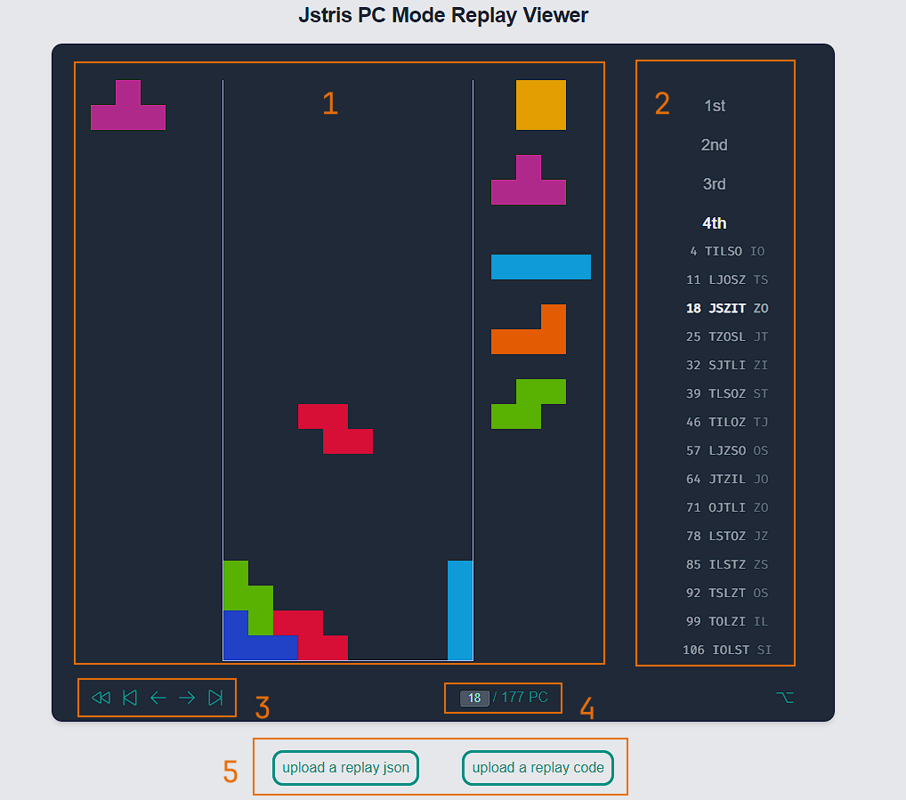
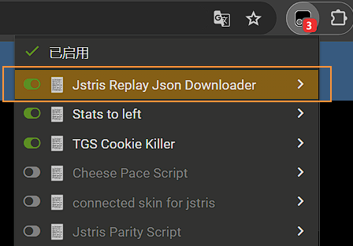
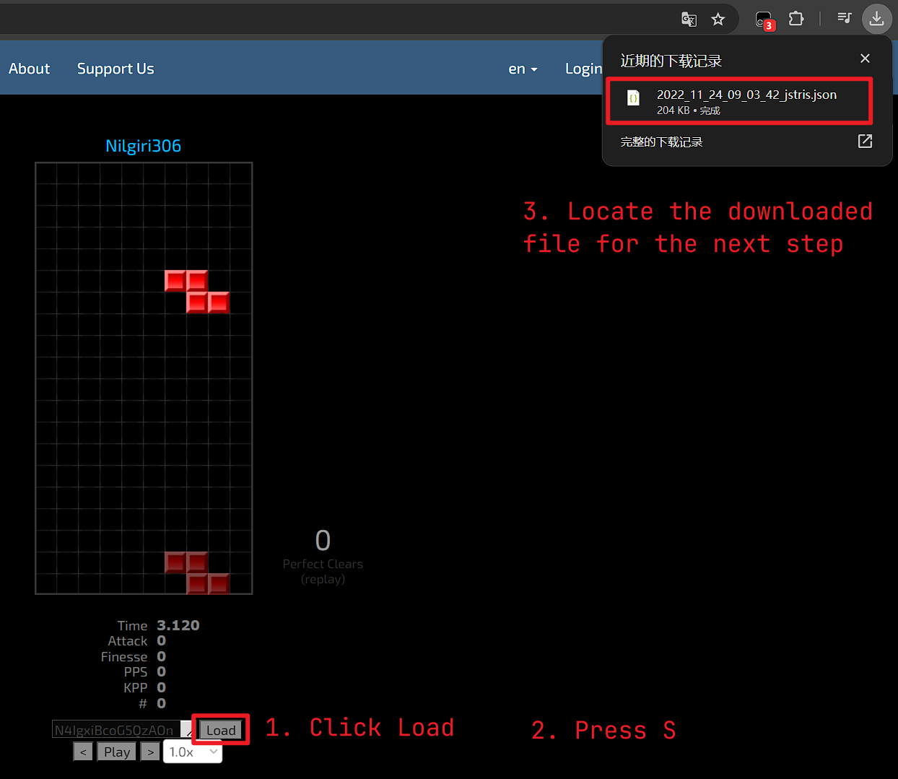

# Jstri PC Mode Replay Viewer

A Web-based tool for reviewing Jstris PC Mode replay. 

Demo: [GitHub Page](https://smdbs-smdbs.github.io/jstris-pc-mode-replay-viewer/)

## Description



As shown in the above image, there are 5 major regions in the UI:

1. __Replay Region__ This region shows the board, queue, and the falling piece before each piece placement.

2. __Side Controls__ This region categories PCs in this run to a number from 1-7 as in the [70-piece loop theory](https://docs.google.com/document/d/1udtq235q2SdoFYwMZNu-GRYR-4dCYMkp0E8_Hw1XTyg), the current PC number in this replay, and the queue of Tetriminos that each PC starts with. You can __click__ on a specific item to jump to that PC.

3. __Bottom Controls__ This region contains the control buttons for the replay. The buttons are (from left to right):
  - __Reset__ / Back to the first PC
  - __Back__ to the previous PC
  - __Undo__ the last piece
  - __Place__ the next piece
  - __Forward__ to the next PC

4. __Settings Region__ This region contains an input box that you can use to quickly jump to a specific PC.

5. __Upload Region__ This region contains two buttons for uploading a replay to this viewer. For more specific instructions, please refer to the [Upload Replay](#upload-replay) section.

> You might notice the button in the bottom right corner. It is supposed to open up an options menu, but it has no functionality because I don't know what should be in the options... Welcome to [contribute](#contribute) to this project.

## Upload Replay

There are two uploading methods:

#### Upload a replay code/url

1. In the viewer, click the **upload a replay code/url** button and open up a Jstris PC Mode replay, then either -
  - Copy the replay link in the url bar. It should be in the format of `https://jstris.jezevec10.com/replay/12345678`. Paste it in the popped up input area and click "**Upload**"
  - Copy the replay code to the left of the **Load** button. Paste it in the popped up input area and click "**Upload**"

2. Wait a few seconds until the reponses are received. The replay will then show up in the viewer.

>There's an issue with the api I use that the queue after certain number of pieces placed will not be shown. If you see `Replay too long`, please use the [second method](#upload-a-replay-json).

#### ~~Upload a replay json~~ 

>Since this method is simply more complicated, please use [the other method above](#upload-a-replay-codeurl) unless it is not possible (when Jstris server is down or the replay is too long).

1. Install [TamperMonkey](https://www.tampermonkey.net/index.php) from [Chrome Store](https://chrome.google.com/webstore/detail/tampermonkey/gppongmhjkpfnbhagpmjfkannfbllamg) or [Firefox Store](https://addons.mozilla.org/en-US/firefox/addon/tampermonkey/).
2. Download and import [this script](./md_assets/PCReplayDownloader.js) into the TamperMonkey console (or create a new script and paste the code into it).
3. Open a Jstris PC Mode replay, make sure the extension is enabled by click the TamperMonkey icon

4. Click the **Load** button, let the script run for a few seconds.
5. After you can see pieces appear in the replay, press down __S__ key to download the json.

6. In the viewer, click the **upload a replay json** button and select the file you just downloaded.

## Contribute

Please see the [GitHub tutorial](https://docs.github.com/en/get-started/exploring-projects-on-github/contributing-to-a-project) on forking and sending pull requests. (Have fun editing my tailwind styles!)

If you have any questions, please feel free to [open an issue](https://github.com/smdbs-smdbs/jstris-pc-mode-replay-viewer/issues).

## Run on your local machine

```sh
git clone git@github.com:smdbs-smdbs/jstris-pc-mode-replay-viewer.git
cd jstris-pc-mode-replay-viewer
npm install
npm run dev
```

### Compile 

```sh
npm run build
```